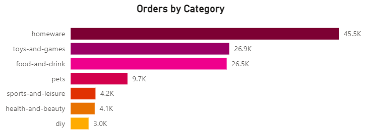

# Data Analytics Power BI Report 910

You have recently been approached by a medium-sized international retailer who is keen on elevating their business intelligence practices. With operations spanning across different regions, they've accumulated large amounts of sales from disparate sources over the years.

## Table of Contents
1. [Introduction to Read Me](#introduction)
1. [Import Data into Power BI](#section-1)
1. [Creating the Data Model](#section-2)
1. [Setting Up Report](#section-3)
1. [Customer Detail Page](#section-4)
1. [Executive Summary Page](#section-5)
1. [Product Detail Page](#section-6)
1. [Stores Map Page](#section-7)
1. [Cross-filtering and Navigation](#section-8)
1. [Create Metrics for Users Outside the Company Using SQL](#section-9)

## Introduction to Read Me
-------------------
This read me is used to document the progression of this project.
Document your achievements in a comprehensive manner. Update the README file on the GitHub repository of this project with detailed information about the tasks accomplished in this milestone.

## Import Data into Power BI
-----------------------
The first step to the project is data loading and preparation.   This means importing the relevant tables into Power BI and then using the Power Query Editor to transform and clean the data as needed.

The dataset set consists of 4 tables: an Orders fact table and three dimensions tables for Products, Customers and Stores. 
 
Each of these are stored in different ways and so require different ways to import them into Power BI.

--------------------------------------
### Orders Table

The Orders table is the main fact table.  
It contains information about each order, including the order and shipping dates, the customer, store and product IDs for associating with dimension tables, and the amount of each product ordered.
Each order in this table consists of an order of a single product type, so there is only one product code per order.

#### Importing the Orders Table 

The Orders fact table is stored as an Azure SQL Database.

#### Data Preparation

 To ensure data privacy, delete the column named [Card Number] 
> = Table.RemoveColumns(dbo_orders_powerbi,{"Card Number"})

Change data type of Order and Shipping data to datetime.
> = Table.TransformColumnTypes(#"Removed Columns",{{"Order Date", type datetime}, {"Shipping Date", type datetime}})

Split Order date into date and time columns
> = Table.SplitColumn(Table.TransformColumnTypes(#"Changed Type", {{"Order Date", type text}}, "en-GB"), "Order Date", Splitter.SplitTextByDelimiter(" ", QuoteStyle.Csv), {"Order Date.1", "Order Date.2"})

and then rename these two columns.
> = Table.RenameColumns(#"Changed Type1",{{"Order Date.1", "Order Date"}, {"Order Date.2", "Order Time"}})

Repeat this for Shipping date
> = Table.SplitColumn(Table.TransformColumnTypes(#"Renamed Columns", {{"Shipping Date", type text}}, "en-GB"), "Shipping Date", Splitter.SplitTextByDelimiter(" ", QuoteStyle.Csv), {"Shipping Date.1", "Shipping Date.2"})

> = Table.RenameColumns(#"Changed Type2",{{"Shipping Date.1", "Shipping Date"}, {"Shipping Date.2", "Shipping Time"}})

Filter out and remove any rows where the [Order Date] column has missing or null values to maintain data integrity.
> = Table.SelectRows(#"Renamed Columns1", each [Order Date] <> null and [Order Date] <> "")

Lastly, rename the columns in your dataset to align with Power BI naming conventions, ensuring consistency and clarity in your report
> = Table.RenameColumns(#"Filtered Rows",{{"product_code", "Product Code"}})

-----------------------------------
### Products Table

The Products table contains information about each product sold by the company, including the product code, name, category, cost price, sale price, and weight.

#### Importing the Products Table 

The Products table is stored as a csv file so is easily imported into power BI by selecting the Text/CSV option under Get Data and then navigating to the csv file on your local machine.

#### Data Preparation

As the dimensions table for products, it is essential that each product code is unique.   We can do this by using the Remove Duplicates function on the [product_code] column.
> = Table.Distinct(#"Changed Type", {"product_code"})

Now, rename the columns in your dataset to align with Power BI naming conventions, ensuring consistency and clarity in your report
> = Table.RenameColumns(#"Removed Duplicates",{{"description", "Description"}, {"sale_price", "Sale Price"}, {"weight", "Weight"}, {"category", "Category"}, {"date_added", "Date Added"}, {"product_uuid", "Product UUID"}, {"availability", "Availability"}, {"product_code", "Product Code"}, {"cost_price", "Cost Price"}})

------------------------------
### Stores Table

The Stores table contains information about each store, including the store code, store type, country, region, and address.

#### Importing the Stores Table 

The Stores table is stored in Azure Blob Storage. It is imported into Power BI by selecting Azure Blob Storage under Get Data and using the credentials for the storage.

When initially imported into Power BI, it appears as a single row table. 
The table is accessed by entering the Power Query Editor view and clicking on the link under the content column to gain access to the csv file contained in the Azure Blob storage.

#### Data Preparation

By right clicking on the region column, we can see the option to filter.  There should be three regions but there are also two misspelled regions: eeEurope and eeAmerica.  
We can replace these misspelled regions using Replace Values tool.
> = Table.ReplaceValue(#"Changed Type","eeEurope","Europe",Replacer.ReplaceText,{"region"})
> = Table.ReplaceValue(#"Replaced Value","eeAmerica","America",Replacer.ReplaceText,{"region"})

Now, rename the columns in your dataset to align with Power BI naming conventions, ensuring consistency and clarity in your report.
> = Table.RenameColumns(#"Replaced Value1",{{"id1", "ID1"}, {"id2", "ID2"}, {"id3", "ID3"}, {"address", "Address"}, {"longitude", "Longitude"}, {"town", "Town"}, {"store code", "Store Code"}, {"staff numbers", "Staff Numbers"}, {"date_opened", "Date Opened"}, {"store_type", "Store Type"}, {"latitude", "Latitude"}, {"country_code", "Country Code"}, {"region", "Region"}, {"country_region", "Country Region"}})

Lastly, there seems to be three id columns that don't serve any purpose so we can delete these columns.
> = Table.RemoveColumns(#"Renamed Columns",{"ID1", "ID2", "ID3"})

-----------------------------------------
### Customers Table

#### Importing the Customers Table 

The Customer table is stored as three seperate Excel CSV files in a folder.

To import it into Power BI, download the Customers.zip file and unzip it on your local machine. 
In Power BI, click get Data Data and select Folder.  
As each file has the same format, they can be easily combined by selecting Combine and Transform when initially importing the data.

#### Data Preparation

First, we want to create a [Full Name] column by combining the [First Name] and [Last Name] columns. This is done by navigating to Add Column on the ribbon, selecting the two columns and then clicking merge columns which will create a new column concatenating the selected columns.
> = Table.AddColumn(#"Filtered Rows", "Merged", each Text.Combine({[First Name], [Last Name]}, " "), type text)

The new column is added to the end so reorder the columns so that the merged column at the start.
>= Table.ReorderColumns(#"Inserted Merged Column",{"Source.Name", "Merged", "First Name", "Last Name", "Date of Birth", "Company", "email", "Address", "Country", "Country Code", "Telephone", "Join Date", "User UUID"})

Now, rename the columns in your dataset to align with Power BI naming conventions, ensuring consistency and clarity in your report.
> = Table.RenameColumns(#"Reordered Columns",{{"Merged", "Full Name"}, {"email", "Email"}})

Lastly, delete any obviously unused columns; in this case [Source.Name].
> = Table.RemoveColumns(#"Filtered Rows1",{"Source.Name"})

-----------------------
### Save 
Save the latest version of your Power BI .pbix file and upload it to the Github repository. 

## Creating the Data Model
-----------------------------
### Date Table

Firstly, we want to make a date table. This is essential for using Power BI's Time Intelligence functions.

To make a date table, navigate to Table Tools on the ribbon and select New Table.  
It needs to cover all dates beginning at the start of the year of the earliest order date to the end of the year of the latest shipping date.
> Date = CALENDAR(DATE(2010,1,1), DATE(2023,12,31))
Lastly, mark as Date table so that Power BI's time intelligence will work.

At this point, the date date is a single column consisting of all dates between 01/01/2010 and 31/12/2023 so we want to add some more columns to make it more helpful to us.

Day of Week
> Day of Week = FORMAT('Date'[Date],"dddd")

> Day Of Week Number = WEEKDAY('Date'[Date], 2)
    
Month Number (i.e. Jan = 1, Dec = 12 etc.)
> Month Number = MONTH('Date'[Date])

Month Name
> Month Name = FORMAT('Date'[Date],"mmmm")

Quarter
>Quarter = QUARTER('Date'[Date])

Year
> Year = YEAR('Date'[Date])
    
Start of Year
> Start Of Year = STARTOFYEAR('Date'[Date])

Start of Quarter
> Start Of Quarter = STARTOFQUARTER('Date'[Date])

Start of Month
> Start Of Month = STARTOFMONTH('Date'[Date])

Start of Week
> Start Of Week = 'Date'[Date] - WEEKDAY('Date'[Date],2) + 1
    
Week Number
> Week Number = WEEKNUM('Date'[Date])

--------------------------------------
### Star Schema

Next, create relationships between the tables to form a star schema.  
This can be easily done in the model view by dragging a column from one table to the column that you want it to be related to.

The relationships we want are:
- Products[Product Code] to Orders[Product Code]
- Stores[Store code] to Orders[Store Code]
- Customers[User UUID] to Orders[User ID]
- Date[date] to Orders[Order Date]
- Date[date] to Orders[Shipping Date]

Make sure all relationships are one-to-many with a single filter direction flowing from the dimension table side to the fact table side.

There are two reltionships between Orders and Date tables but make sure to select Date[date] to Orders[Order Date] as the active relationship.

--------------------------------
### Measures Table

Creating a measures table helps to keep the data model organized and easy to navigate.  
From the Model view, select Enter Data from the Home tab of the ribbon; name the new blank table Measures Table and then click Load.

-------------------------------
### Key Measures

Begin filling up the measures table with some helpful measures that will be used throughout the report. These will give a good starting point for building the analysis.

1. Create a measure called Total Orders that counts the number of orders in the Orders table.
    > Total Orders = COUNT(Orders[Order Date])

2. Create a measure called Total Revenue that multiplies the Orders[Product Quantity] column by the Products[Sale Price] column for each row, and then sums the result.
    > Total Revenue = SUMX(Orders, Orders[Product Quantity] * RELATED(Products[Sale Price]))

3. Create a measure called Total Profit which performs the following calculation:
    - For each row, subtract the Products[Cost Price] from the Products[Sale Price], and then multiply the result by the Orders[Product Quantity]
    - Sums the result for all rows
    > Total Profit = SUMX(Orders, (RELATED(Products[Sale Price]) - RELATED(Products[Cost Price])) * Orders[Product Quantity])

4. Create a measure called Total Customers that counts the number of unique customers in the Orders table. This measure needs to change as the Orders table is filtered, so do not just count the rows of the Customers table.
    > Total Customers = DISTINCTCOUNT(Orders[User ID])

5. Create a measure called Total Quantity that counts the number of items sold in the Orders table.
    > Total Quantity = SUM(Orders[Product Quantity])

6. Create a measure called Profit YTD that calculates the total profit for the current year.
    > Profit YTD = TOTALYTD([Total Profit], 'Date'[Date])

7. Create a measure called Revenue YTD that calculates the total revenue for the current year
    > Revenue YTD = TOTALYTD([Total Revenue], 'Date'[Date])

-------------------------------
### Date Hierarchy

The date Hierarchy should have the following levels:
- Start of Year
- Start of Quarter
- Start of Month
- Start of Week
- Date

We can create the hierarchy in the Model view by navigating to the Date table in the Data panel and right clicking on the highest level we want in the hierarchy; in this case start of Year.  
We then right click on each level we wish to add in order and select Add to hierarchy.

-------------------------------------------
### Geography Hierarchy

We first need to create a second calculated column in the Stores table called Country that creates a full country name for each row, based on the Stores[Country Code] column. 
> Country = SWITCH([Country Code], "GB", "United Kingdom", "US", "United States", "DE", "Germany")

Next, create a new calculated column in the Stores table called Geography that creates a full geographical name for each row, based on the Stores[Country Region], and Stores[Country] columns, separated by a comma and a space.
> Geography = Stores[Country Region] & ", " & Stores[Country]

We then need to change the data categories in column tools for the Stores Table so that Power BI recognises these column as geographical.
- Region : Continent
- Country : Country
- Country Region : State or Province

Finally, the geography hierarchy has the following levels:
- World Region
- Country
- Country Region

We can create the hierarchy in the Model view in the same way as the Date hierarchy.

-----------------------------------
### Save

Save the latest version of your Power BI .pbix file and upload it to the Github repository.

## Setting Up Report 
------------------------
### Create report Pages

Create four report pages and name them as follows:
- Executive Summary
- Customer Detail
- Product Detail
- Stores Map

Choose a colour scheme : Solar

------------------------------
### Add navigation sidebar

On the Executive Summary page, add a rectangle shape covering a narrow strip on the left side of the page. Set the fill colour to a contrasting colour of your choice. This will be the sidebar that we will use to navigate between pages later in our report build.

Duplicate the rectangle shape on each of the other pages in your report

------------------------------------
### Save

Save the latest version of your Power BI .pbix file and upload it to the Github repository.

## Customer detail Page
----------------------------------------

Create a report page based on customer-level analysis.

This page will contain the following visuals:
- Card Visuals for total distinct customers and revenue per customer
- A donut chart showing number of customers by country, and another showing number of customers by product category
- A line chart of weekly distinct customers
- A table for the top 20 customers by total revenue, showing the revenue per customer and the total orders for each customer
- A set of three card visuals showing the name, number of orders, and revenue for the top customer by revenue
- A date slicer

-------------------------------
### Headline Card Visuals

To create the Card Visuals first create two rectangles and arrange them in the top left corner of the page. These will serve as the backgrounds for the card visuals.

The first card visual is for total distinct customers. 
Select card in the build panel, [Total Customer] measure for the field and rename the field to Unique Customers by right-clicking on the field in the build panel and selecting 'rename for this visual'.

In the formatting panel: adjust font size of Callout Value to 35 and Category Label to 12; change font colour to white and turn the background to 100% transparency. 

The second card visual is revenue per customer. We first need to create a new measure in the Measures Table called [Revenue per Customer].
> Revenue per Customer = [Total Revenue] / [Total Customers]

Then select this new measure as the field for the Card visual.
Format in the same way as the previous card and then finally, go to `Format > Properties > Data Format ` and select currency. 

Picture             |  Build            |  Data Format             |  Transparency
:-------------------------:|:-------------------------:|:-------------------------:|:-------------------------:
 ||  |  

------------------------------
### Donut Charts

Add a Donut Chart visual showing the total customers for each country, using the Customers[Country] column to filter the [Total Customers] measure.

Picture        |  Build            |  Format Labels            |  Format Title
:-------------------------:|:-------------------------:|:-------------------------:|:-------------------------:
||  |  

Add a second Donut Chart visual showing the number of customers who purchased each product category, using the Products[Category] column to filter the [Total Customers] measure

For both visuals:
- change the titles text and font size and make bold; 
- format the labels to appear outside the donut and display the category 
- and set legend to off in the Format panel.

Legend On       |  Legend Off   
:-------------------------:|:-------------------------:
||

----------------------------------------
### Line Chart

Add a Line Chart visual to the top of the page. It should show [Total Customers] on the Y axis, and use the Date Hierarchy for the X axis. 
 Make sure only, year, quarter and month are selected in the date hierarchy to allow users to drill down to the month level, but not to weeks or individual dates.

Picture       |.
:-------------------------:|:-------------------------:

Formatting:
- Change title to Customers Trending then center and bold it
- Remove x and y axis titles
- Add a trend line and change to dotted line (I also changed the colour)
- Add forecast for the next 10 periods with a 95% confidence interval
- Finally, add a zoom slider for the x-axis

Build  | Title  | Forecast |  Trendline | Zoom Slider
:-------------------------:|:-------------------------:|:-------------------------:|:-------------------------:|:-------------------------:
|||  |  

---------------------------------------------
### Top 20 Customers Table

Create a table visual, which displays the top 20 customers, filtered by revenue. The table should show each customer's full name, revenue, and number of orders.
  Select the column customer[Full Name], measure [Total revenue] and measure [Total Orders].

Picture | Build | Filters
:-------------------------:|:-------------------------:|:-------------------------:
|||

Formatting:
- Filter Full Name by Top 20 by [Total Revenue]
- Give table the title to 'Top 20 customers' and bold it
- Sort by total revenue descending
- Add conditional formatting to the revenue column, to display data bars for the revenue values
    - go to Format > Cell Element > Total revenue and set data bars to on.
- Add conditional formatting to the orders column, to chnage the background colour for depending on total orders
    - go to Format > Cell Element > Total orders and set background colour to on.

Title  | Sort By |  Data Bars | Background
:-------------------------:|:-------------------------:|:-------------------------:|:-------------------------:
||  |  

There is a blank name row which I will take a look at later to see if its worth deleting

--------------------------------------------
### Top Customer Card

Create a set of three card visuals that provide insights into the top customer by revenue. They should display the top customer's name, the number of orders made by the customer, and the total revenue generated by the customer.

For the Name Card:
- Field is Full Name
- Add Top N filter on full name Top 1 by value Total revenue
- Add title 'Top customer by revenue' and make bold

For the Orders Card:
- Field is Total Orders
- Add Top N filter on full name Top 1 by value Total revenue
- Add title 'Orders' and make bold

For the Revenue Card:
- Field is Total Revenue
- Add Top N filter on full name Top 1 by value Total revenue
- Add title 'Revenue' and make bold
- Change data format to currency

For all three card visuals: set background to transparent, add a rectangle shape behind and delete category label.

Picture  | Name Card Filters |  Orders Card Filters | Revenue Card Filters
:-------------------------:|:-------------------------:|:-------------------------:|:-------------------------:
 |||

--------------------------------------
### Data Slicer

Add a data slicer visual with year as the field and slicer style set to between.

Picture | Build | Filters
:-------------------------:|:-------------------------:|:-------------------------:
|||

------------------------------------------------
### Finished Page

----------------------------------
### Save

Save the latest version of your Power BI .pbix file and upload it to the Github repository.
You should describe the visuals you created for this page, and add screenshots of how the visuals were set up, and a screenshot of the finished page.

## Executive Summary Page
--------------------------------------------
Create a report page for the high level executive summary, to give an overview of the companies performance as a whole.

The report will contain the following visuals:
- Card visuals showing Total revenue, Total Profits, Total Orders
- A graph of revenue against time
- Two donut charts showing orders and revenue by country
- A bar chart of orders by category
- KPI's for Quarterly revenue, customers and profits

--------------------------
### Card Visuals

Copy a card visual from the Customer Detail page and paste it onto the Executive Summary page 3 times.
  Assign them to your Total Revenue, Total Orders and Total Profit measures.
  Use the Format > Callout Value pane to ensure no more than 1 decimal place in the case of the Total Orders measure. 
  Use the Format > Data Format pane to set the revenue and profit cards to currency and set to 2 decimal places.

Pictures | Revenue Filters | Profit Filters | Orders Filters
:-------------------------:|:-------------------------:|:-------------------------:|:-------------------------:
|||

-----------------------------
### Revenue Line Chart

As with the card visuals, you can copy the line graph from your Customer Detail page, and change it as follows:
- Set Y-axis to Total Revenue
- Change the title to "Revenue Trending" then center it
- Change the gridlines 
- Change data format of y axis values to currency

Picture | Gridlines
:-------------------------:|:-------------------------:
|

---------------------------------
### Donut Charts

Add a pair of donut charts, showing Total Revenue broken down by Store[Country Code] and Store[Store Type] respectively.

Add a second Donut Chart visual showing the Total Revenue broken down by Store[Store Type].

For both visuals:
- Change the titles to 'Revenue by Country' and 'Revenue by Store Type' respectively 
- Change the font size of the titles to 14, then center and bold them 
- Format the labels to appear outside the donut and to display the category 
- Set legend to off in the Format panel.

-------------------
### Bar Chart

Add a bar chart showing number of orders by product category.

Pick the clustered bar chart visual and select the measure [Total Orders] for the x-axis field and the column Product[Category] for the y-axis field.

Formatting:
- Remove "Total" from title and then centre and bold it
- Remove titles from the y and x axis
- Remove x axis values
- Remove gridlines
- Turn on data labels and set to one decimal place.
- Change bar colours to be different for each category

Picture | Bar Colours 
:-------------------------:|:-------------------------:
|

----------------------------
### KPI Charts

To create the KPIs charts for Quarterly Revenue, Orders and Profit we need to create a set of new measures for the quarterly targets. 
 The targets should be equal to 5% growth in each measure compared to the previous quarter so we need to first create measure to calculate the previous quarter profit/revenue/orders before making the target measures.

Create the following measures:
- Previous Quarter Profit
    > Previous Quarter Profit = CALCULATE([Total Profit], PREVIOUSQUARTER('Date'[Date]))
- Previous Quarter Revenue
    > Previous Quarter Revenue = CALCULATE([Total Revenue], PREVIOUSQUARTER('Date'[Date]))
- Previous Quarter Orders
    > Previous Quarter Orders = CALCULATE([Total Orders], PREVIOUSQUARTER('Date'[Date]))
- Targets, equal to 5% growth in each measure compared to the previous quarter
    - Target Profit
        > Target Profit = [Previous Quarter Profit] * 1.05
    - Target Revenue
        > Target Revenue = [Previous Quarter Revenue] * 1.05
    - Target Orders
        > Target Orders = [Previous Quarter Orders] * 1.05

For each KPI chart:
 The Value field should be Total Revenue/Profit/Orders
 The Trend Axis should be Start of Quarter
 The Target should be Target Revenue/Profit/Orders

I was having some trouble with this step as my dates table extended past the latest shipping date of 29 June 2023 to the end of 2023 which resulted in the target not returning any value.
  So I changed the date table to end at the end of the second quarter in 2023.
> Date = CALENDAR(DATE(2010,1,1), DATE(2023,06,30))

Formatting :
- Change the titles to Quarterly Revenue/Profit/Orders, then center and bold them
- Decrease font size of the callout value from 45 to 38 and set decimal place to 1
- Change target label to 'Previous Quarter' and change the font size to 10
- Set Trend Axis to On and set values as:
    - Direction : High is Good
    - Bad Colour : red
    - Transparency : 15%

Picture | Build | Trend Axis
:-------------------------:|:-------------------------:|:-------------------------:
||

------------------------------------------------
### Extra : Top 10 Products Table

In the example layout, there was an additional table for the top 10 products sorted by orders which I have added.
To create the table, select: 
- Description
- Category
- Total revenue (with data bars)
- Total customers
- Total orders.

Formatting:
- Select the column Products[Description], Products[Category], measure [Total revenue], measure [Total Customers] and measure [Total Orders]
    - Filter Descriptions by Top 10 by [Total Orders]
    - Rename Description column header to 'Top 10 Products'
- Add conditional formatting to the revenue column, to display data bars for the revenue values
    - Go to Format > Cell Element > Total revenue and set data bars to on.
- Change total revenue to dispaly values as currency
    - Go to Format > Data Format > select Total Revenue > select Currency as Data Format and set decimal place to 2

----------------------------------------------
### Finished Page

-----------------------------------------
### Save

Save the latest version of your Power BI .pbix file and upload it to the Github repository.
You should describe the visuals you created for this page, and add screenshots of how the visuals were set up, and a screenshot of the finished page.

## Product Detail Page
--------------------------------------

This page provides an in-depth look at which products within the inventory are performing well, with the option to filter by product and region.

The report will contain the following visuals:
- Gauge visuals to show how the selected categories revenue, profit and number of orders are performing against a quarterly target
- card visuals to show which filters are currently selected
- An area chart showing relative revenue performance of each category over time
- A table showing the top 10 products by revenue in the selected context
- A scatter graph of quantity ordered against profit per item for products in the current context.

-------------------------------------
### Gauge Visuals

Add a set of three gauges, showing the current-quarter performance of Orders, Revenue and Profit against a quarterly target. The CEO has told you that they are targeting 10% quarter-on-quarter growth in all three metrics.

First of all we need to define a few more measure in the measures table.

- Current quarter performance of Orders, Revenue and Profit:
    > QTD Orders = TOTALQTD([Total Orders], 'Date'[Date])

    > QTD Profit = TOTALQTD([Total Profit], 'Date'[Date])

    > QTD Revenue = TOTALQTD([Total Revenue], 'Date'[Date])
- Quarterly targets for each metric which will be equal to the previous quarters performance multiplied by 1.1 for a 10% increase
    > Quarterly Target Orders = CALCULATE(TOTALQTD([Total Orders], 'Date'[Date]) * 1.1, DATEADD('Date'[Date], -1, QUARTER))
    
    > Quarterly Target Profit = CALCULATE(TOTALQTD([Total Profit], 'Date'[Date]) * 1.1, DATEADD('Date'[Date], -1, QUARTER))
    
    > Quarterly Target Revenue = CALCULATE(TOTALQTD([Total Revenue], 'Date'[Date]) * 1.1, DATEADD('Date'[Date], -1, QUARTER))
- gap between target and the performance measures (i.e. Current - Target).
    > Quarterly Gap Orders = [QTD Orders] - [Quarterly Target Orders]
    
    > Quarterly Gap Profit = [QTD Profit] - [Quarterly Target Profit]

    > Quarterly Gap Revenue = [QTD Revenue] - [Quarterly Target Revenue]
While defining these measures, in the 'Properties' pane, select the Currency in relation to the relevant measures, and set the Currency Symbol as £.

To create the three gauges, in each case, set the value to be the QTD and the maximum value of the gauge to be the target, so that the gauge shows as full when the target is met.

Picture | Build | Conditional Formatting
:-------------------------:|:-------------------------:|:-------------------------:
||

Apply conditional formatting to the callout value, so that it shows as orange if the target is not yet met, and black otherwise. 
 This can be done by naviagting to `Format > Callout Value > Colour` and clicking 'fx' for conditional formatting. Then selecting 'Rules' for the Format Style and the relevant 'gap' measure for the field it is based on.
  If the target is met then the gap measure should be equal to or greater than zero, if it isn't then the gap measure is negative. 
 So, the first rule should be that if value is greater than Min and less than 0 then the colour is orange. 
 The second rule is that if the value is greater than or equal to 0 and less than Max then the colour is black.

Formatting:
- Change font size of the data label values (min and max) to 10.
- Change the titles to 'Quarterly Orders/Profit/Revenue vs Target' and then center and bold it
- Make the callout value bold and change the data format of the callout values for revenue and profit to currency.

--------------------------
### Filter Cards

To the left of the gauges, place two placeholder shapes for the cards which will show the filter state for the page.

We will add values to these that will reflect the filter state of the slicers. But to do this, we need to define the following measures:
> Category Selection = IF(ISFILTERED(Products[Category]), SELECTEDVALUE(Products[Category], "No Selection"))

> Country Selection = IF(ISFILTERED(Stores[Country]), SELECTEDVALUE(Stores[Country],"No Selection"))

Now add a card visual to each of the rectangles, and one of these measures to each of them. 

Formatting:
- Reduce text size to 18, font colour to white and centre it
- Make card visual background transparent

------------------------------
### Area Chart

We now want to add an area chart that shows how the different product categories are performing in terms of revenue over time.

Add a new area chart and apply the following fields:
 X axis as Dates[Start of Quarter]
 Y axis values as Total Revenue
 Legend as Products[Category]

Formatting
- Remove the axis titles
- Change the data format of revenue to currency

--------------------------------
### Top Products Table

Add a top 10 products table underneath the area chart. 

Selct the following fields for the table:
- Product Description
- Category
- Total Revenue
- Total Customers
- Total Orders
- Profit per Order ???? Not in example visual

Formatting:
- Filter Descriptions by Top 10 by [Total Orders]
    - Rename Description column header to 'Top 10 Products'
- Add conditional formatting to the revenue column to display data bars for the revenue values
    - go to Format > Cell Element > Total revenue and set data bars to on.
- Change the data format of total revenue to currency and set decimal place to 2

--------------------------------------
### Scatter Graph

The products team want to know which items to suggest to the marketing team for a promotional campaign. They want a visual that allows them to quickly see which product ranges are both top-selling items and also profitable.
 A scatter graph would be ideal for this job.

Create a new calculated column called [Profit per Item] in the Products table.
> Profit per Item = Products[Sale Price] - Products[Cost Price]

Add a new Scatter chart to the page, and configure it as follows:
 Values as Products[Description]
 X-Axis as Products[Profit per Item]
 Y-Axis as Orders[Total Quantity]
 Legend as Products[Category]

I had to use average of profit per item due to repetition in the Products[Description] of products with the same name but different product code.

Formatting:
- Change title to 'Orders vs Profitability'
- Rename field 'Average of Profit per Item' to 'Profit per Item'

------------------------------------------------
### Slicer Toolbar

Use Power BI's bookmarks feature to create a pop-out toolbar which can be accessed from the navigation bar on the left-hand side of our report so that we can add multiple slicers without cluttering the layout of the page.

First of all, download the folder of custom icons.

Now, add a new blank button to the top of the navigation bar, set the icon type to Custom in the Format pane, and choose Filter_icon.png as the icon image. Also set the tooltip text to Open Slicer Panel so that when you hover the mouse it will tell a user what the button does.

Button Icon Format | Button Type Format
:-------------------------:|:-------------------------:
|

The action of the button will be type bookmark and will open the bookmark Slicer Bar Open (which will be made in a moment).

Add a new rectangle shape in the same colour as your navigation bar. Its dimensions should be the same height as the page, and about 3-5X the width of the navigation bar itself. Open the Selection pane and bring it to the top of the stacking order.

Add two new slicers in the Vertical List slicer style. Set one to Products[Category] and the other to Stores[Country] then change the titles to Product Category and Country respectively.

Picture | Selection Pane | Slicer Format
:-------------------------:|:-------------------------:|:-------------------------:
||

It should be possible to select multiple items in the Product Category slicer and the Country slicer should have Select All option On.

We need to add a Back button so that we can hide the slicer toolbar when it's not in use so add a new button, and select the Back button type.

Finally, in the Selection pane group the slicers with your slicer toolbar shape.

Now, we can make the two bookmarks.
 So, open the Bookmarks pane and add two new bookmarks: one with the toolbar group hidden in the Selection pane, and one with it visible. 
 Name them Slicer Bar Closed and Slicer Bar Open. Right-click each bookmark in turn, and ensure that Data is unchecked. This will prevent the bookmarks from altering the slicer state when the toolbar is opened or closed.

Lastly, assign each bookmark as the action for the filters button and back button.

Formatting
- Delete slicer header and add a title instead for both
- Decrease font size of values from 12 to 10
- Make background transparent
- Change padding in values from 4px to 2px

I've also made it so the category data slicer doesn't interact with the area chart as the area chart is supposed to show all the product categories but that the country data slicer still does.

------------------------------------------
### Additional cards

I have also added to additional cards as shown in the example layout for most ordered product and highest revenue product.

-----------------------------------------------
### Finished Page

-----------------------------------------
### Save

Save the latest version of your Power BI .pbix file and upload it to the Github repository.
You should describe the visuals you created for this page, and add screenshots of how the visuals were set up, and a screenshot of the finished page.

## Stores Map Page
-----------------------------------------------

A page that can be used to easily see which stores are most profitable, as well as which are on track to reach their quarterly revenue and profit targets.

------------------------------------------
### Map Visual

On the Stores Map page, add a new map visual. 
It should take up the majority of the page, just leaving a narrow band at the top of the page for a slicer. 
Set the style to light in the Format pane, and check Show Labels is set to On.

Set the controls of your map as follows:
 Auto-Zoom: On
 Zoom buttons: Off
 Lasso button: Off

Assign your Geography hierarchy to the Location field, and ProfitYTD to the Bubble size field

Build | Style and Controls
:-------------------------:|:-------------------------:
|

Formatting
- Set the data format of Profit YTD to currency and 2 decimal place
- Turn off title

--------------------------------------
### Country Slicer

Add a slicer above the map, set the slicer field to Stores[Country], and in the Format section set the slicer style as Tile and the Selection settings to Multi-select with Ctrl/Cmd and Show "Select All" as an option in the slicer.

----------------------------------------
### Finished Stores Map Page

--------------------------------------
### Stores Drillthrough Page

To make it easy for the region managers to check on the progress of a given store, we need to create a drillthrough page that summarises each store's performance.

This will include the following visuals:
- A table showing the top 5 products based on Total Orders, with columns: Description, Profit YTD, Total Orders, Total Revenue
- A column chart showing Total Orders by product category for the store
- Gauges for Profit YTD against a profit target of 20% year-on-year growth vs. the same period in the previous year. The target should use the Target field, not the Maximum Value field, as the target will change as we move through the year.
- A Card visual showing the currently selected store

#### Stores Drillthrough Page

    

Create a new page named Stores Drillthrough. Open the format pane and expand the Page information tab. Set the Page type to Drillthrough and set `Drill through when` to Used as category. Set `Drill through from` to country region.

The drillthrough page is accessed by right clicking on an area of the store page map and selecting drill through.

#### Measures for visuals

We are going to need some measures for the gauges as follows:
- Profit YTD and Revenue YTD: You should have already created this earlier in the project
- Profit Goal and Revenue Goal, which should be a 20% increase on the previous year's year-to-date profit or revenue at the current point in the year
    > Profit Goal = CALCULATE(TOTALYTD([Total Profit], 'Date'[Date]) * 1.20, DATEADD('Date'[Date], -1, YEAR))

    > Revenue Goal = CALCULATE(TOTALYTD([Total Revenue], 'Date'[Date]) * 1.20, DATEADD('Date'[Date], -1, YEAR))

#### Top 5 Products table

Create a table and select Description, Profit YTD, Total Orders, Total Revenue for the columns. 
  Filter Description by Top 5 by Total Orders.

I've currently got it based on Profit YTD not Total Orders.

#### Column Chart

Add a new Column chart to the page, and configure it as follows:
 X-Axis as Products[Category]
 Y-Axis as [Total orders]

Formatting
- Delete x and y axis titles
- Change the bars colour to all be different

#### Gauges

Add a two new Gauges to the page, and configure them as follows:
 Value as Profit/Revenue YTD
 Target as Profit/Revenue Goal

Formatting:
- Change the data format for both to currency
- Make the callout values bold and change the font colour
- Decrease font size for target, min and max values to 10

#### Card

Add a new Card visual to the page, and set the field to the calculated column Geography to show region and country that is selected.

Formatting:
- Rename the field to Store location and downsize font of the callout value
- Add a border to visual

#### Finished Drillthrough Page

-----------------------------------------
### Stores Tooltip Page

    

You want users to be able to see each store's year-to-date profit performance against the profit target just by hovering the mouse over a store on the map. To do this, create a custom tooltip page, and copy over the profit gauge visual, then set the tooltip of the visual to the tooltip page you have created.

- Make new page and call is stores tooltip page
- Copy over profit gauge
- Copy over geography card and rename to location
- Go back to stores map page and on the map visual, go to Format > Properties, turn on tooltips and set type to report page and page to stores tooltip page

---------------------------
### Finished Tooltip Page

-----------------------------------------
### Save

Save the latest version of your Power BI .pbix file and upload it to the Github repository.
You should describe the visuals you created for this page, and add screenshots of how the visuals were set up, and a screenshot of the finished page.

## Cross-Filtering and Navigation
------------------------------------------
### Interactions

Power BI has cross-highlighting set up by default on most visual  so that clicking on a region in one visual will automatically filter all the others on the page. This can be good for certain visual but confusing with others so we need to edit the interactions as follows.

Executive Summary Page
- Product Category bar chart and Top 10 Products table should not filter the card visuals or KPIs

Customer Detail Page
- Top 20 Customers table should not filter any of the other visuals 
- Total Customers by Product Category Donut Chart should not affect the Customers line graph 
- Total Customers by Country donut chart should cross-filter Total Customers by Product Category Donut Chart
Note: I've also turned off interaction of the slicer to the customer line chart

Product Detail Page
- Orders vs. Profitability scatter graph should not affect any other visuals 
- Top 10 Products table should not affect any other visuals

-------------------------------
### Navigation

Our final task is to add navigation buttons for the individual report pages.

For each page, there is a custom icon available in the custom icons collection you downloaded earlier in the project. For each icon there are two colour variants. 
We will use the white version for the default button appearance, and the cyan one so that the button changes colour when hovered over with the mouse pointer. 

In the sidebar of the Executive Summary page, add four new blank buttons, and in the Format > Button Style pane, make sure the Apply settings to field is set to Default, and set each button icon to the relevant white png in the Icon tab.

    
    

For each button, go to Format > Button Style > Apply settings to and set it to On Hover, and then select the alternative colourway of the relevant button under the Icon tab.
 I also went back to product page and added this to the filter icon as I initially hadnt done this.

For each button, turn on the Action format option, and select the type as Page navigation, and then select the correct page under Destination.

Finally, group the buttons together, and copy them across to the other pages.

-------------------------------
### Save

Document your achievements in a comprehensive manner. Update the README file on the GitHub repository of this project with detailed information about the tasks accomplished in this milestone. You should describe the changes you made to the visual cross-filtering actions, as well as how you set up the navigation sidebar.

Finally, save the latest version of your Power BI .pbix file and upload it to the Github repository.

## Create Metrics for Users Outside the Company Using SQL
------------------------------------

### Connect to SQL Server

You will be using a Postgres database server hosted on Microsoft Azure. To connect to the server and run queries from VSCode, you will need to install the SQLTools extension.

Connect to the server using the credentails for the azure database.

Make sure to set SSL Encryption to enabled in the connection settings.

--------------------------------------------
### Table and Column Names

The table and column names in this database are different from the ones in Power BI.

Print a list of the tables in the database and save the result to a csv file for reference.

Print a list of the columns in each table and save the result to a csv file called [table name]_columns.csv

These files can be located in the folder table_info.

-------------------------------
### Query the Database

Write SQL queries to answer the following questions. In each case, once you are happy with the result of the query, export the result to a csv file.

1. How many staff are there in all of the UK stores?
2. Which month in 2022 has had the highest revenue?
3. Which German store type had the highest revenue for 2022?
4. Create a view where the rows are the store types and the columns are the total sales, percentage of total sales and the count of orders
5. Which product category generated the most profit for the "Wiltshire, UK" region in 2021?

The .sql and .csv files for these queries are located in the folder sql_queries.

---------------------------------
### Save
Document your achievements in a comprehensive manner. Update the README file on the GitHub repository of this project with detailed information about the tasks accomplished in this milestone. Also ensure that your SQL queries and results are uploaded to the Github repository.
